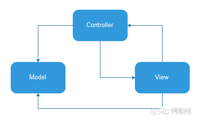
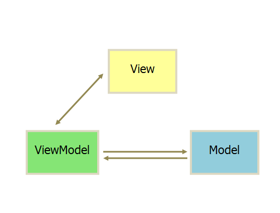

> 架构要解决的问题：
>
> **控制逻辑，数据处理逻辑和界面交互耦合**
>
> 1、事件的传递
>
> 2、数据的传递

### MVC

```
MVC(Model-View-Controller)
模型层 (Model)：业务逻辑对应的数据模型，与View无关，而与业务相关；
视图层 (View)：一般使用XML或者Java对界面进行描述；
控制层 (Controllor)：在Android中通常指Activity和Fragment，或者由其控制的业务类。
Activity并非标准的Controller，它一方面用来控制了布局，另一方面还要在Activity中写业务代码，造成了Activity既像View又像Controller。
```




图片说明：View接受用户事件，调用control去更新model，同时control去刷新view，view也可以直接更新model
在传统的开发中Activity充当了control又充当了view的角色，既要接受用户相应操作model，又要刷新view
这样做的好处是数据的更新变得很简单，缺点是Activity变得臃肿不好维护

### MVP

```
MVP(Model-View-Presenter)
模型层 (Model)：主要提供数据存取功能。
视图层 (View)：处理用户事件和视图。在Android中，可能是指Activity、Fragment或者View。
展示层 (Presenter)：负责通过Model存取数据，连接View和Model，从Model中取出数据交给View。

2、这里的Model是用来存取数据的，也就是用来从指定的数据源中获取数据，不要将其理解成MVC中的Model。在MVC中Model是数据模型，在MVP中，我们用Bean来表示数据模型。
1、Model和View不会直接发生关系，它们需要通过Presenter来进行交互。在实际的开发中，我们可以用【接口】来定义一些规范，然后让我们的View和Model实现它们，并借助Presenter进行交互即可。

优点：
1、降低耦合度，实现了 Model 和 View 真正的完全分离，可以修改 View 而不影响 Modle；
2、模块职责划分明显，层次清晰；
3、隐藏数据；
4、Presenter 可以复用，一个 Presenter 可以用于多个 View，而不需要更改 Presenter 的逻辑；
5、利于测试驱动开发，以前的Android开发是难以进行单元测试的；
6、View 可以进行组件化，在MVP当中，View 不依赖 Model。

缺点：
1、Presenter 中除了应用逻辑以外，还有大量的 View->Model，Model->View 的手动同步逻辑，造成 Presenter 比较笨重，维护起来会比较困难；
2、由于对视图的渲染放在了 Presenter 中，所以视图和 Presenter 的交互会过于频繁；
3、如果 Presenter 过多地渲染了视图，往往会使得它与特定的视图的联系过于紧密，一旦视图需要变更，那么Presenter也需要变更了。
```


>### MVC 和 MVP 的区别
>
>1. MVC 中是允许 Model 和 View 进行交互的，而MVP中，Model 与 View 之间的交互由Presenter完成；
>2. MVP 模式就是将 P 定义成一个接口，然后在每个触发的事件中调用接口的方法来处理，也就是将逻辑放进了 P 中，需要执行某些操作的时候调用 P 的方法就行了。

#### MVVM

```
MVVM(Model-View-ViewModel)
模型层 (Model)：负责从各种数据源中获取数据；
视图层 (View)：在 Android 中对应于 Activity 和 Fragment，用于展示给用户和处理用户交互，会驱动 ViewModel 从 Model 中获取数据；
ViewModel 层：用于将 Model 和 View 进行关联，我们可以在 View 中通过 ViewModel 从 Model 中获取数据；当获取到了数据之后，会通过自动绑定，比如 DataBinding，来将结果自动刷新到界面上。ViewModel不再持有View的层的引用，数据处理完之后会自动通知View层

	它是将“数据模型和数据双向绑定”的思想作为核心，因此在View和Model之间没有联系，通过ViewModel进行交互，而且Model和ViewModel之间的交互是双向的，因此视图的数据的变化会同时修改数据源，而数据源数据的变化也会立即反应到View上。

MVVM的优点：
1、低耦合：视图（View）可以独立于Model变化和修改，一个 ViewModel 可以绑定到不同的 View 上，当 View 变化的时候 Model 可以不变，当 Model 变化的时候 View 也可以不变。
2、可重用性：你可以把一些视图逻辑放在一个 ViewModel 里面，让很多 view 重用这段视图逻辑。
3、独立开发：开发人员可以专注于业务逻辑和数据的开发（ViewModel），设计人员可以专注于页面设计。
4、可测试：界面素来是比较难于测试的，而现在测试可以针对 ViewModel 来写。

MVVM的一个缺点：View的复用问题
使用DataBinding会导致一个View一个Model，导致View的复用性降低
同时出现问题排查起来更困难，因为使用的是双向绑定，所以出现问题很难确定是model的问题还是data的问题，还是设置数据的问题
```



> MVVM模式相对于MVP模式主要有如下优点：
>
> 进一步降低了耦合。ViewModel层不持有View层的引用，当View层发生改变时，只要View层绑定的数据不变，那么ViewModel层就不需要改变。而在MVP模式下，当View层发生改变时，操作视图的接口就要进行相应的改变，那么Presenter层就需要修改了。
> 不用再编写很多样板代码。通过官方的Data Binding库，UI和数据之间可以实现绑定，不用再编写大量的findViewById()和操作视图的代码了。总之，Activity/Fragment的代码可以做到相当简洁。

> 一般MVVM模式使用ViewModel和LiveData来作为ViewModel层，因为它们具有生命周期感知的特性，并且支持双向绑定和数据更新通知。

# Jetpack
## 架构


ViewModel（监听状态变化） + ViewBinding（减少样板代码）

#### MVI

Model-View-Intent


> 组件化、插件化