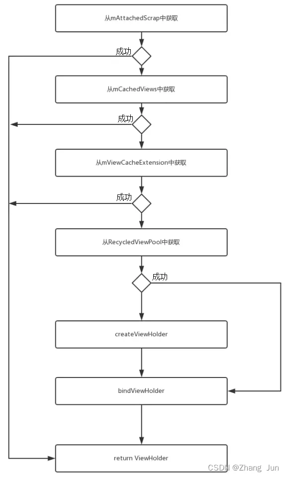

#### ListView

```
RecycleBin
	AbListView的内部类主要用于缓存和回收View用的
	RecycleBin是用于ListView子元素的缓存。里面有一个View[] mActiviesViews和ArrayList<View>[] mScrapViews。mActiviesViews用于存放ListView在屏幕内的对象，mScrapViews用于存放ListView移出屏幕的对象。注意mScrapViews是一个List类型的数组，索引是ItemType，元素是ArrayList<View>，所以说视图是按照ItemType为维度回收的，所以复用也是ItemType维度复用的。
	ListView中的所有元素，都是存在mActiviesViews里面一份的，所以当ListView刷新时，可以很快速的从内存中取出View来布局。当ListView上滑并且元素0完全移出屏幕时，会回收到RecycleBin的mScrapViews里面的ItemType类型为索引的ArrayList里面。
	当上面布局移出屏幕并且下面布局移进屏幕时，则mActiviesViews将顶部的布局移除放入mScrapViews里面缓存，从mScrapViews中取出底部布局的缓存放入mActiviesViews中
	
	setViewTypeCount()：初始化mScrapViews数组，并给每个数组元素初始化一个ArrayList对象，数组的长度为setViewTypeCount()传入的值。
	getScrapView()：从缓存中取出一个View，取出之后会从mScrapViews数组中删除
	addScrapView()：将一个View缓存到mScrapViews数组中
	getActiveView()：从mActiviesViews数组中取出一个View，取出之后即会删除
	fillActiveViews()：添加一个View到fillActiveViews数组中

Adapter
	隔离了数据。
	ListView只承担交互和展示工作而已，对于要展示的内容和数据不关心。adapter原意适配器，是数据源和ListView之间的一个桥梁，将数据映射到要展示的View中。ListView负责以列表的形式显示adapter提供的内容。adapter是一个接口，提供了一套统一的方法让子类实现，以实现不同的效果。

绘制过程：
	第一次layout。第一次layout，在RecycleBin获取不到mActiviesViews缓存，所以调用getView()直接朝adapter要View，要来了View后，然后逐个layout布局。
	第N次layout。在RecycleBin获取到mActiviesViews缓存，然后逐个layout布局

因为存在复用，所以如果元素0的图片会莫名出现在元素6的图片里面。元素0的图片还没有下载完，元素6出来之后，可能会设置成元素0的图片。所以我们一般通过设置tag来排除不对应的图片下载和默认占位图来解决图片错位的问题。

观察者模式：
	ListView继承自AbListView，AbListView在onAttachedToWindow()的时候初始化了AdapterDataSetObserver，调用adapter.registerDataSetObserver()注册监听，当调用adapter.notifyDataSetChanged()会触发AdapterDataSetObserver.onChanged()，然后会执行requestLayout()来进行刷新

猜测：
	在ListView进行滑动的时候，如果RecycleBin中的mScrapViews里面没有缓存，则直接调用getView()重新创建，如果有缓存直接获取；滑出的布局会被RecycleBin缓存到mScrapView中，如果在滑动过程中只有回收，没有复用，则mScrapView会将滑出的View全部缓存（这种情况是itemType为1的全部滑出屏幕，后面进来的都是itemType为2的布局）
	mScrapView中缓存的View数据不会多于mActiviesViews的数量，如果多于就会删除（多于mActiviesViews的部分没有意义，因为页面如果全用缓存的也只会用到mActiviesViews个）
```

#### RecyclerView

[RecyclerView](http://www.javashuo.com/article/p-vjbahsyh-gx.html)

```
Adapter：处理数据集合并负责绑定视图
	1、根据不同ViewType创建与之相应的ItemLayout
	2、访问数据集合并将数据绑定到正确的View上
	在recyclerView.setAdapter()时，会调用adapter.registerAdapterDataObserver()，注册一个监听数据变化的观察者，当数据变化时会调用adapter.notifyItem***()，都会调用AdapterDataObservable.notifyChanged()，然后调用RecyclerViewDataObserver.onChanged()，RecyclerViewDataObserver是AdapterDataObservable的实现者；RecyclerViewDataObserver.onChanged()中会调用requestLayout()进行刷新数据
	
ViewHolder：持有所有的用于绑定数据或者需要操作的View
	1、adapter应当拥有ViewHolder的子类，并且ViewHolder内部应当存储一些子view，避免时间代价很大的findViewById操作
	2、其RecyclerView内部定义的ViewHolder类包含很多复杂的属性，内部使用场景也有很多，而我们经常使用的也就是onCreateViewHolder()方法和onBindViewHolder()方法，onCreateViewHolder()方法在RecyclerView需要一个新类型item的ViewHolder时调用来创建一个ViewHolder，而onBindViewHolder()方法则当RecyclerView需要在特定位置的item展示数据时调用。

LayoutManager：职责是摆放Item的位置，并且负责决定何时回收和重用Item。
	RecyclerView 允许自定义规则去放置子 view，这个规则的控制者就是 LayoutManager。一个 RecyclerView 如果想展示内容，就必须设置一个 LayoutManager

	LinearLayoutManager 水平或者垂直的Item视图。
	GridLayoutManager 网格Item视图。
	StaggeredGridLayoutManager 交错的网格Item视图。


Recycler：负责管理ViewHolder缓存
	mAttachedScrap：ArrayList<ViewHolder>类型，用于缓存已经滑出屏幕但是还没有从RecyclerView中移除的ViewHolder
	
	mChangedScrap：ArrayList<ViewHolder>类型，用于保存数据改变了的ViewHolder
	
	mCachedViews：ArrayList<ViewHolder>类型，用于缓存View，默认大小为mViewCacheMax+计算的值，主要用于解决RecyclerView滑动抖动时的情况
	mViewCacheMax = mRequestedCacheMax + extraCache，mRequestedCacheMax 默认为 2，extraCache是由prefetch的时候计算出来的
	
	mRecyclerPool：回收处，缓存回收的ViewHolder对象，有限的mCachedViews中如果存不下ViewHolder时，就会把ViewHolder存入RecyclerViewPool中。
	
	mViewCacheExtension：提供给开发中自己处理的缓存类，getViewForPositionAndType()方法让开发者提供自己的缓存

RecycledViewPool
	RecyclerViewPool用于多个RecyclerView之间共享View。只需要创建一个RecyclerViewPool实例，然后调用RecyclerView的setRecycledViewPool(RecycledViewPool)方法即可。RecyclerView默认会创建一个RecyclerViewPool实例。
	
	内部类ScrapData，包含了mScrapHeap和mMaxScrap
	mScrapHeap：ArrayList<ViewHolder>类型，用于缓存ViewHolder的集合
	mMaxScrap = DEFAULT_MAX_SCRAP：默认为5，表示最大缓存多少个ViewHolder
	
	mScrap：SparseArray<ScrapData>的集合，key为itemType
	调用setMaxRecycledViews(int viewType, int max)时，当用于复用的mScrap中viewType对应的ViewHolder个数超过maxNum时，会从列表末尾开始丢弃超过的部分。调用getRecycledView(int viewType)方法时从mScrap中移除并返回viewType对应的List的末尾项
	

ItemDecoration：负责绘制Item附近的分割线
	1、通过设置recyclerView.addItemDecoration(new DividerDecoration(this));来改变Item之间的偏移量或者对Item进行装饰。
	2、也可以对RecyclerView设置多个ItemDecoration，列表展示的时候会遍历所有的ItemDecoration并调用里面的绘制方法，对Item进行装饰
ItemDecoration 对象的 onDraw onDrawOver 方法：
	这两个抽象方法，由我们继承 ItemDecoration 来自己实现，他们区别就是 onDraw 在 item view 绘制之前调用，onDrawOver 在 item view 绘制之后调用。
	所以绘制顺序就是 Decoration 的 onDraw，ItemView的 onDraw，Decoration 的 onDrawOver。

ItemAnimator：为Item的一般操作添加动画效果，如，增删条目等

ViewCacheExtension
	ViewCacheExtension是一个由开发者控制的可以作为View缓存的帮助类。调用Recycler.getViewForPosition(int)方法获取View时，Recycler先检查attachedscrap和一级缓存，如果没有则检查ViewCacheExtension.getViewForPositionAndType(Recycler, int, int)，如果没有则检查RecyclerViewPool。注意：Recycler不会在这个类中做缓存View的操作，是否缓存View完全由开发者控制。

AdapterDataObserver
RecyclerViewDataObserver

SavedState

State

ViewFlinger

SmoothScroller

ItemTouchHelper：
	长按item后拖动，与其他item交换位置
	按住item右面的图标后拖动，与其他item交换位置
	左滑item变透明并缩小，超出屏幕后，其他item补上
	右滑item变透明并缩小，超出屏幕后，其他item补上
	
SpanSizeLookup
	RecyclerView 可以通过 GridLayoutManager 来设置网格中指定Item的列数，要实现指定某个item所占列数的功能我们需要用到GridLayoutManager.SpanSizeLookup这个类，该类是一个抽象类，里面包含了一个getSpanSize(int position)的抽象方法，该方法的返回值就是指定position所占的列数

getViewForPosition()中获取viewholder的方式，通过几层获取？
首先Recycler会先去检查mChangedScrap，如果匹配成功则返回相应的viewHolder。mChangedScrap就是所谓的detachedView，与RecyclerView分离的viewHolder列表。
然后是mAttachedScrap，mCachedViews，mViewCacheExtension，mRecyclerPool，如果都没有，则去创建，调用Adapter.createViewHolder()。
mChangedScrap、mAttachedScrap、mCachedViews、mViewCacheExtension、mRecyclerPool、前面都没有就去调用createViewHolder

1、一级缓存 mAttachedScrap / mChangedScrap
	mAttachedScrap：缓存未与RecyclerView分离的ViewHolder
	mChangedScrap：缓存数据已经改变的ViewHolder需要调用onBindViewHolder()方法
2、二级缓存 mCachedViews，缓存划出屏幕的ViewHolder
	默认为2，可以通过setViewCacheSize()来设置
3、三级缓存 ViewCacheExtension 用户自定义扩展缓存，RecyclerView通过ViewCacheExtension.getViewForPositionAndType(Recycler, int, int)来获取用户是否设置了缓存
	可以通过Recyclerview.setViewCacheExtension()来设置
4、四级缓存 mRecyclerPool(RecycledViewPool) 
	在mCachedViews中如果缓存已满的时候（默认最大值为2个），先把mCachedViews中旧的ViewHolder 存入到RecyclerViewPool。如果RecyclerViewPool缓存池已满，就不会再缓存。从缓存池中取出的ViewHolder，需要重新调用bindViewHolder绑定数据。
	a.按照 ViewType 来查找 ViewHolder
	b.每个 ViewType 默认最多缓存 5 个
	c.可以多个 RecyclerView 共享 RecycledViewPool
	d.使用 SparseArray 来存储不同 ViewType 的 ViewHoler

```


> RecyclerView卡顿的原因有哪些：
>
> 1、滑动控件嵌套导致卡顿，如ScrollView嵌套recyclerView
>
> ​	尽量使用一个滑动控件实现
>
> 2、布局层级太深或者太复杂
>
> ​	优化布局层级，去掉不需要的控件，使用RelativeLayout/ConstraintLayout来减少布局层级
>
> 3、加载图片过多或者加载大图
>
> ​	在页面滑动过程中停止加载图片，在列表停止后再加载图片，大图进行压缩处理
>
> 4、在onCreateViewHolder和onBindViewHolder中做了耗时操作
>
> ​	尽量不要在onCreateViewHolder和onBindViewHolder中做耗时操作，尽量将耗时操作后移

> RecyclerView优化：
>
> 1、缓存数据，使用DiffUtil局部刷新
>
> 2、布局优化，减少层级和不必要的布局
>
> 3、点击事件优化
>
> 4、如果item的高度都是固定的话，可以使用RecyclerView.setHasFixedSize(true)来减少测量来提高速度
>
> 5、如果多个RecycleView的adapter是一样的可以通过RecyclerView.setRecycledViewPool(pool)来共用一个缓存池，复用viewholder
>
> 6、分页加载数据
>
> 7、如果不需要动画，可以将动画给关掉
>
> 8、点击事件优化，避免在onBindViewHolder中设置监听，因为这个方法会多次调用

