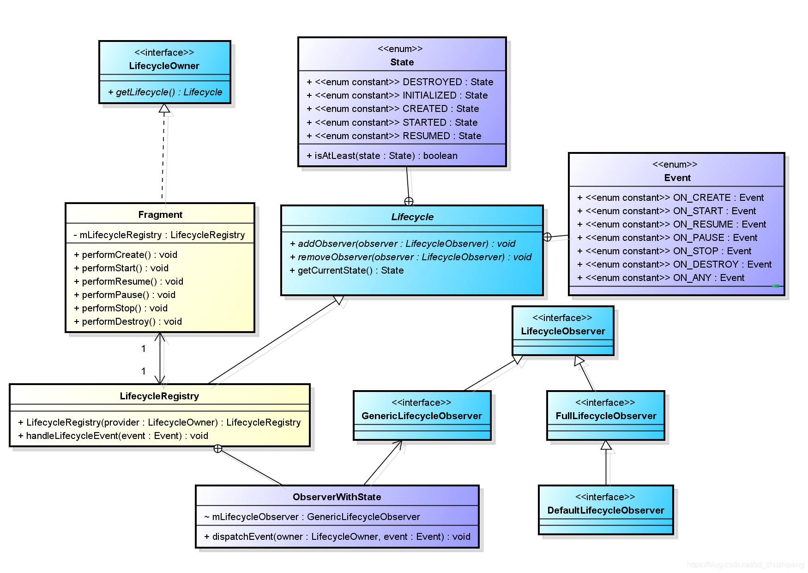
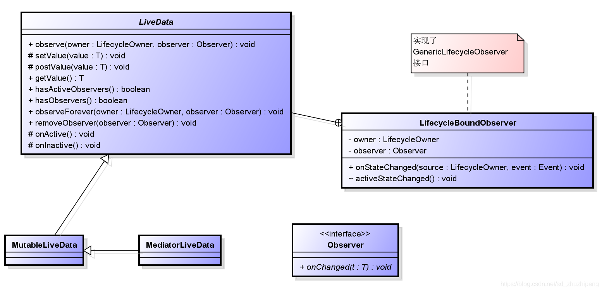
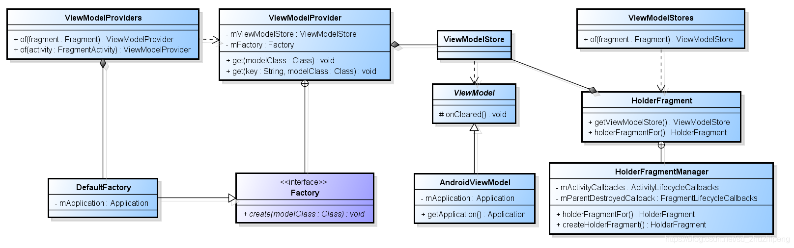

## JetPack

### Lifecycle

```     	
实现LifecycleObserver接口的方式：
1、实现LifecycleEventObserver接口，然后重写里面生命周期方法；
2、直接实现LifecycleObserver接口，然后通过注解的方式来接收生命周期的变化；
对于这两种形式，Lifecycle.java文档中是建议使用第一种方式，因为文档中说明了，随着Java8成为主流，注解的方式会被弃用。

注意：在ON_CREATE/ON_START/ON_RESUME是在各个生命周期方法on***之后调用的，ON_PAUSE/ON_STOP/ON_DESTROY是在各个生命周期方法on***之前调用的

LifecycleOwner：被观察者
    实现类：ComponentActivity、Fragment、LifecycleService
    用来观察的对象，实现LifecycleOwner.getLifecycle()，来获取Lifecycle对象，添加观察者
    ComponentActivity、Fragment均创建了LifecycleRegistry（extends Lifecycle）对象
    LifecycleService创建了ServiceLifecycleDispatcher，ServiceLifecycleDispatcher是对LifecycleRegistry的一个封装

LifecycleObserver：观察者
    用户自己实现并添加到LifecycleRegistry中

Lifecycle：实现类LifecycleRegistry，定义了addObserver() 和 removeObserver()
    内部有Event和State枚举类，用来定义生命周期的事件和状态

Activity的监听
1、在ComponentActivity.onCreate()方法中创建了ReportFragment
2、在ReportFragment的每个生命周期方法中会回调生命周期状态
3、ReportFragment.on***() 生命周期方法，实现LifecycleEventObserver的回调
    -> ReportFagment.dispatch() 
    -> getActivity().getLifecycle().handleLifecycleEvent() == LifecycleRegistry.handleLifecycleEvent()
    -> mLifecycleObserver.onStateChanged()
4、mLifecycleObserver对象通过Lifecycling.lifecycleEventObserver(observer)来获取
5、Lifecycling.lifecycleEventObserver(observer)会通过observer是否是实现了LifecycleEventObserver，如果是则返回LifecycleEventObserver，接着走LifecycleEventObserver.onStateChanged()
6、如果不是实现了LifecycleEventObserver，则返回ReflectiveGenericLifecycleObserver()对象，走ReflectiveGenericLifecycleObserver.onStateChanged()，会通过反射获取具体添加了注解的方法然后调用

Fragment的监听
在Fragment中的处理方式是在Fragment初始化LifecycleRegistry供getLifecycle调用然后注册LifecycleObserver，在Fragment中的各个生命周期方法中都调用了dispatch(Lifecycle.Event event) 方法分发各个Event事件

App的监听
1、系统定义了一个ProcessLifecycleOwnerInitializer extends ContentProvider，在app启动的时候，会自动启动这个ContentProvider，并且会先于Application启动
    ProcessLifecycleOwnerInitializer在打包的时候会自动放在AndroidManifest.xml中
2、在ProcessLifecycleOwnerInitializer.onCreate() 
    -> ProcessLifecycleOwner.init()
    -> ProcessLifecycleOwner.attach()
    -> Application.registerActivityLifecycleCallbacks() 来监听所有Activity的生命周期
    使用mStartedCounter和mResumedCounter来记录当前打开和处于resume状态的Activity的个数，
    当mResumedCounter等于0时，表示当前App处于后台 == ON_PAUSE
    当mStartedCounter等于0时，表示当前App退出 == ON_STOP
    在attach()中调用 ON_CREATE，ON_DESTROY永远不会调用
使用方式：
    定义一个MyAppObserver继承LifecycleObserver
    在Application.onCreate()中调用
    ProcessLifecycleOwner.get().getLifecycle().addObserver(new MyAppObserver());

```



### LiveData

```
LiveData是一个数据持有类，有以下特点：
1、数据可以被观察者订阅；
2、能够感知组件（Fragment、Activity、Service）的生命周期（组件指实现了LifecycleOwner接口的Fragment、Activity）
3、只有在组件处于激活状态（STARTED、RESUMED）才会通知观察者有数据更新；

LiveData具有以下优点：
1、能够保证数据和UI统一
 这个和LiveData采用了观察者模式有关，LiveData是被观察者，当数据有变化时会通知观察者（UI）。
2、减少内存泄漏
 这是因为LiveData能够感知到组件的生命周期，当组件处于DESTROYED状态时，观察者对象会被清除掉。
3、当Activity停止时不会引起崩溃
 这是因为组件处于非激活状态时，不会收到LiveData中数据变化的通知。
4、不需要额外的手动处理来响应生命周期的变化
 这一点同样是因为LiveData能够感知组件的生命周期，所以就完全不需要在代码中告诉LiveData组件的生命周期状态。
5、组件和数据相关的内容能实时更新
 组件在前台的时候能够实时收到数据改变的通知，这是可以理解的。当组件从后台到前台来时，LiveData能够将最新的数据通知组件，这两点就保证了组件中和数据相关的内容能够实时更新。
6、针对configuration change时，不需要额外的处理来保存数据
  我们知道，当你把数据存储在组件中时，当configuration change（比如语言、屏幕方向变化）时，组件会被recreate，然而系统并不能保证你的数据能够被恢复的。当我们采用LiveData保存数据时，因为数据和组件分离了。当组件被recreate，数据还是存在LiveData中，并不会被销毁。
7、资源共享
 通过继承LiveData类，然后将该类定义成单例模式，在该类封装监听一些系统属性变化，然后通知LiveData的观察者
 
LiveData使用
1、直接使用LiveData对象
	（1）创建保存特定数据类型的LiveData实例；
	（2）创建Observer对象，作为参数传入LiveData.observe()方法添加观察者；
	（3）更新Livedata对象存储的数据；
2、继承LiveData类


LiveData类是个抽象类，但是它没有抽象方法
MediatorLiveData继承自MutableLiveData，MutableLiveData继承自LiveData。MediatorLiveData可以看成是多个LiveData的代理，当将多个LiveData添加到MediatorLiveData，任何一个LiveData数据发生变化时，MediatorLiveData都会收到通知。

LiveData有个内部类LifecycleBoundObserver，它实现了LifecycleEventObserver，而LifecycleEventObserver继承了LifecycleObserver接口。当组件（Fragment、Activity）生命周期变化时会通过onStateChanged()方法回调过来。

Observer接口就是观察者，其中定义了LiveData数据变化的回调方法onChanged()。

LiveData主要涉及到的时序有三个：
1、在Fragment/Activity中通过LiveData.observer()添加观察者（observer()方法中的第二个参数）。
2、根据Fragment/Activity生命周期发生变化时，移除观察者或者通知观察者更新数据。
3、当调用LiveData的setValue()、postValue()方法后，通知观察者更新数据。

observeForever()：通过observeForever()添加观察者，观察者会一直受到数据的变化回调，而不是在组件处于STARTED和RESUMED状态下才会收到，因为ObserverWrapper对象是AlwaysActiveObserver，在AlwaysActiveObserver的shouldBeActive() 永远返回true，表示会一直收到回调。
另外通过该方法添加观察者后，要手动调用removeObserver()方法来停止观察者接收回调通知。

observe()：将LifecycleOwner对象和Observer对象封装成LifecycleBoundObserver对象。判断容器中的observer（key）是否有已经和wrapper(value)关联，如果已经关联则返回关联值，否则关联并返回wrapper。
会调用getLifecycle().addObserver()添加生命周期的监听，如果生命周期发生变化会在LifecycleBoundObserver中收到回调。在LifecycleBoundObserver.shouldBeActive()方法中会判断当前生命周期是否是已经销毁isAtLeast(STARTED)

setValue()：判断当前线程是否是主线程，不是主线程就抛出异常，然后通知观察者数据发生变化。必须在UI线程中调用
postValue()：ArchTaskExecutor实现在主线程中执行mPostValueRunnable对象中的内容，而在mPostValueRunnable中最终会调用setValue()方法来实现改变LiveData存储的数据。可以在UI线程或者子线程中调用
ArchTaskExecutor是一个线程池的实现

onActive()，此方法是当处于激活状态的observer个数从0到1时，该方法会被调用。
onInactive() ，此方法是当处于激活状态的observer个数从1变为0时，该方法会被调用。
onActive()和onInactive()都是空实现的方法，继承类可以选择去实现。
```



### ViewModel

> 它是介于View(视图)和Model(数据模型)之间的一个东西。它起到了桥梁的作用，使视图和数据既能分离，也能保持通信。

ViewModel的生命周期




```
负责准备和管理和UI组件(Fragment/Activity)相关的数据类，也就是说ViewModel是用来管理UI相关的数据的。同时ViewModel还可以用来负责UI组件间的通信。在Activity销毁后，会自动执行onCleared()销毁对象，避免内存泄漏。

用于Fragment之间的通信，也是因为ViewModel是Activity中持有的，因此Fragment之间可以通过getActivity()来获取。

ViewModelProvider：用于创建ViewModelProvider
Factory：ViewModelProvider的内部类，工厂方法，用于创建ViewModel对象
ViewModelStore：内部HashMap实现用于保存当前Activity中所有的ViewModel，key为当前ViewModel类的名字+androidx.lifecycle.ViewModelProvider.DefaultKey前缀
AndroidViewModel：用于持有Application Context对象的ViewModel

注意：ViewModel内不能持有Context的对象，或者可能持有Context对象的对象。因为Activity有可能会被recreate，ViewModel的生命周期比Activity的长，因此有可能导致内存泄漏。

```

> ViewModel是如何做到屏幕旋转时activity重新创建而ViewModel仍存在的？
>
> 一个Activity中只有一个ViewModelStore，里面包含了当前Activity中所有的ViewModel。
>
> ComponentActivity指的是androidx/activity/ComponentActivity
>
> 1、在ComponentActivity中通过getLifecycle().addObserver()监听ON_DESTROY的生命周期，并且调用isChangingConfigurations() 判断是否是因为旋转屏幕导致的onDestroy()，如果是的话，就不会走ViewModelStore的clear()方法。

```
// androidx.activity.ComponentActivity()
getLifecycle().addObserver(new LifecycleEventObserver() {
            @Override
            public void onStateChanged(@NonNull LifecycleOwner source,
                    @NonNull Lifecycle.Event event) {
                if (event == Lifecycle.Event.ON_DESTROY) {
                    if (!isChangingConfigurations()) {
                        getViewModelStore().clear();
                    }
                }
            }
        });
```

> 2、在ComponentActivity.onRetainNonConfigurationInstance()方法中会将ViewModelStore包装成NonConfigurationInstances，onRetainNonConfigurationInstance() 会在Activity中调用，将数据缓存起来，避免被回收。
>
> 3、在ComponentActivity.getViewModelStore() 中会重新获取缓存的ViewModelStore赋值给当前Activity的 mViewModelStore 对象。
>
> 因此在屏幕发生旋转的时候会将mChangingConfigurations设置为true，并将ViewModelStore缓存下来，在getViewModelStore()中再赋值给当前的Activity，这就保证了当屏幕旋转导致onDestroy() 而不会回收的原因。

> 4、Activity的ViewModelStore是在ComponentActivity中，Fragment的ViewModelStore是在FragmentManager的FragmentManagerViewModel中的
> 
> Activity中包含了当前Activity中所有的ViewModel，因此有一个ViewModelStore
> 
> Fragment中包含了当前Fragment中所有的ViewModel，因此有一个ViewModelStore
> 
> 而Fragmentmanager管理所有的Fragment，因此在FragmentManagerViewModel中有一个HashMap<String, ViewModelStore> mViewModelStores
> 
> String是Fragment唯一的值
> 
> 当前Fragment通过get(Fragment)来获取自己的ViewModelStore