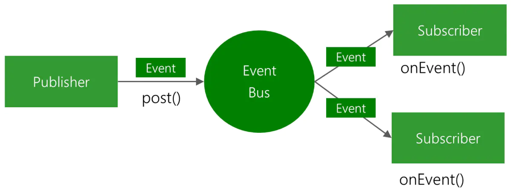
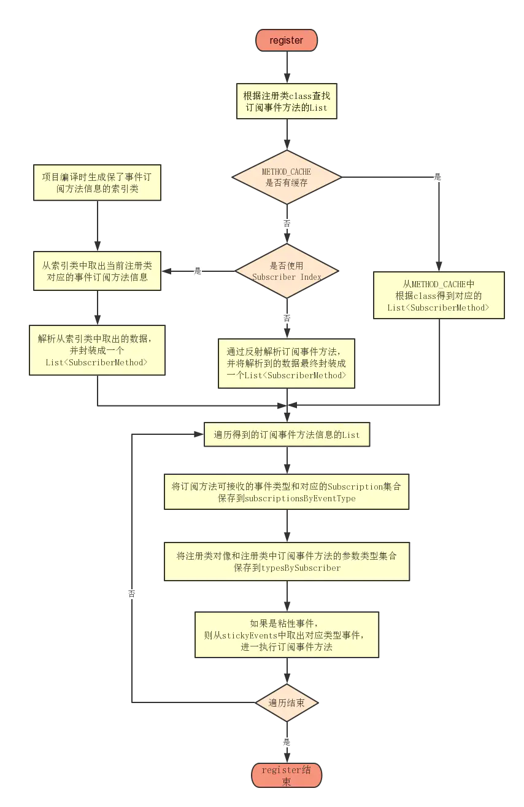
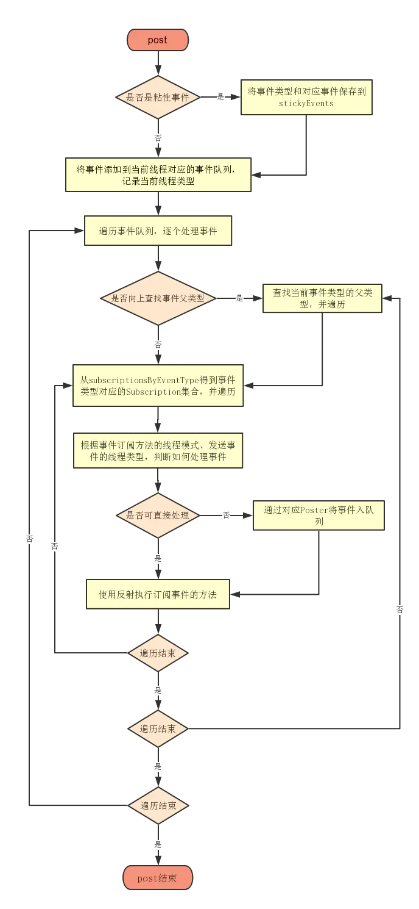
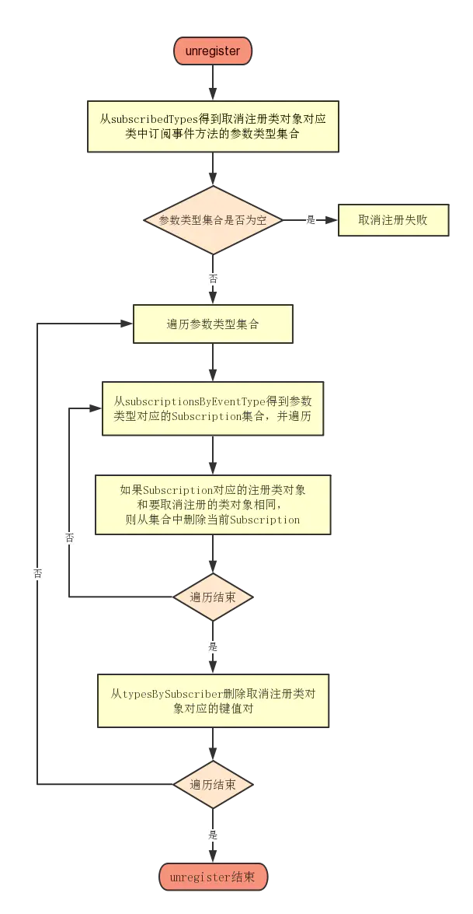

##### EventBus

[参考](https://www.jianshu.com/p/d9516884dbd4)

```
EventBus是一款在 Android 开发中使用的发布/订阅事件总线框架，基于观察者模式，将事件的接收者和发送者分开，简化了组件之间的通信，使用简单、效率高、体积小。

EventBus的threadMode有五种模式：
1、ThreadMode.POSTING，默认的线程模式，在那个线程发送事件就在对应线程处理事件，避免了线程切换，效率高。
2、ThreadMode.MAIN，如在主线程（UI线程）发送事件，则直接在主线程处理事件；如果在子线程发送事件，则先将事件入队列，然后通过 Handler 切换到主线程，依次处理事件。
3、ThreadMode.MAIN_ORDERED，无论在那个线程发送事件，都先将事件入队列，然后通过 Handler 切换到主线程，依次处理事件。
4、ThreadMode.BACKGROUND，如果在主线程发送事件，则先将事件入队列，然后通过线程池依次处理事件；如果在子线程发送事件，则直接在发送事件的线程处理事件。
5、ThreadMode.ASYNC，无论在那个线程发送事件，都将事件入队列，然后通过线程池处理。

线程池处理异步任务
handler处理线程间通信

EventBus 主要是在项目运行时通过反射来查找订阅事件的方法信息，这也是默认的实现，如果项目中有大量的订阅事件的方法，必然会对项目运行时的性能产生影响。

EventBus 还提供了在项目编译时通过注解处理器查找订阅事件方法信息的方式，生成一个辅助的索引类来保存这些信息，这个索引类就是Subscriber Index。其中SUBSCRIBER_INDEX是一个HashMap，保存了当前注册类的 Class 类型和其中事件订阅方法的信息。在查找对应的回调方法时，会从SUBSCRIBER_INDEX里面进行查询，不再通过反射的方式。

基本流程如下：register、post、unregister
```







