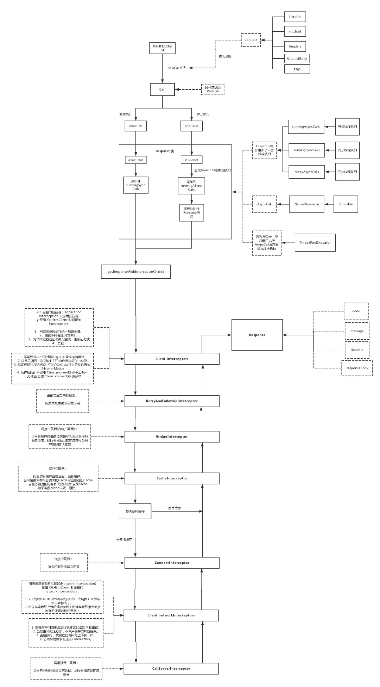
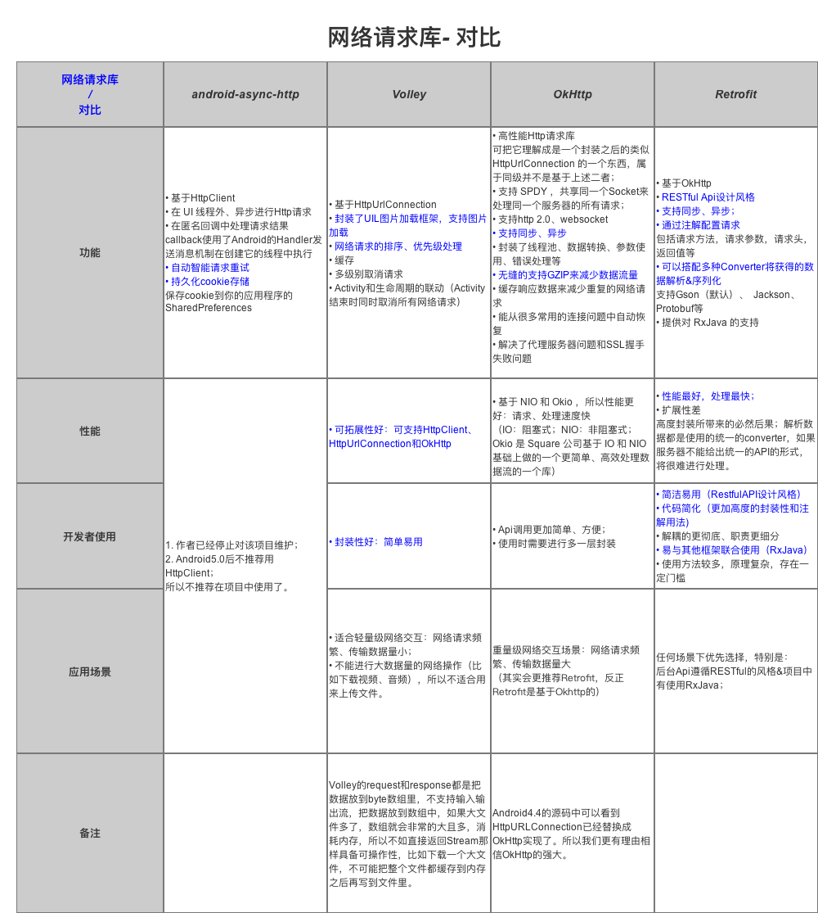

#### Retrofit和OkHttp

##### OkHttp的特性：

```
1、支持Http2.0，对同一台主机的所有请求共享同一个socket（多路复用技术）
2、内置连接池，支持连接复用，减少延迟
3、支持透明gzip压缩响应体（header压缩）
4、通过缓存避免重复的请求
5、请求失败后会自动重试主机的其他IP，自动重定向（RetryAndFllowUpInterceptor）

注意：OKhttp的callBack是在子线程中调用的，因此不能直接在callBack中更新UI
```

##### 5个拦截器和3个队列

```  
拦截器：
1、RetryAndFollowUpInterceptor：重试和重定向拦截器，如果请求失败则会进行重试或者重定向操作
2、BridgeInterceptor：桥接拦截器，应用层和网络层的桥接拦截器，主要工作是为请求添加cookie、添加固定的header，比如Host、Content-Length、Content-Type、User-Agent等等，然后保存响应结果的cookie，如果响应使用gzip压缩过，则还需要进行解压。
3、CacheInterceptor：缓存拦截器，用于处理缓存，如果命中缓存则不会发起网络请求。
4、ConnectInterceptor：网络连接拦截器，内部会维护一个连接池（Transmitter），负责连接复用、创建连接（三次握手等等）、释放连接以及创建连接上的socket流。
5、CallServerInterceptor：请求拦截器，将 http 请求写进 IO 流当中，并且从 IO 流中读取响应 Response。内部使用的是Okio来实现的请求。

队列：
1、readyAsyncCalls：异步准备队列，用于存放当runningAsyncCalls超过上限后的任务，用于后面线程池有空闲的线程后来将readyAsyncCalls里面的任务放入runningAsyncCalls中执行
2、runningAsyncCalls：异步运行队列，用于存储正在运行的异步任务
3、runningSyncCalls：同步运行队列，用于存储正在运行的同步任务
默认的最大并发请求量 maxRequests = 64 和单个 Host 主机支持的最大并发量 maxRequestsPerHost = 5，当runningAsyncCalls队列中正在运行的任务超过了64个，并且当前主机的最大并发量大于5，则将任务放入readyAsyncCalls里面。

在Dispatcher.finished(this)中的promoteCalls();方法中，对等待就绪的异步队列进行遍历，生成对应的AsyncCall实例，并添加到runningAsyncCalls中，最后放入到线程池中执行，一直到所有请求都结束。
```

##### 设计模式

```
1、单例模式：Platform的创建用的是单例模式（饿汉式）
	OkHttpClient可以通过 new OkHttpClient() 或 new OkHttpClient.Builder() 来创建对象，但是特别注意，OkHttpClient()对象最好是共享的，建议使用单例模式创建。因为每个 OkHttpClient 对象都管理自己独有的线程池和连接池。多次创建会占用内存。
	
2、Builder模式：OkHttpClient的创建，Request的创建，Response的创建等
	OkHttpClient 比较复杂，太多属性，而且客户的组合需求多样化，所以OKhttp使用建造者模式（Build模式：使用多个简单的对象一步一步构建成一个复杂的对象，一个 Builder 类会一步一步构造最终的对象）
	
3、工厂方法模式：Call接口提供了内部接口Factory
	用于将对象的创建延迟到该工厂类的子类中进行，从而实现动态的配置，工厂方法模式。（工厂方法模式：这种类型的设计模式属于创建型模式，它提供了一种创建对象的最佳方式。在工厂模式中，我们在创建对象时不会对客户端暴露创建逻辑，并且是通过使用一个共同的接口来指向新创建的对象。）

4、享元模式：在Dispatch的线程池中，用到了享元模式，一个不限容量的线程池，线程空闲存活时间为 60 秒。线程池实现了对象复用，降低线程创建开销。
	（享元模式：尝试重用现有的同类对象，如果未找到匹配的对象，则创建新对象，主要用于减少创建对象的数量，以减少内存占用和提高性能）
	
5、责任链模式：在OKhttp中的拦截器模块，执行过程用到。
	（责任链模式：为请求创建了一个接收者对象的链。这种模式给予请求的类型，对请求的发送者和接收者进行解耦。这种类型的设计模式属于行为型模式。在这种模式中，通常每个接收者都包含对另一个接收者的引用。如果一个对象不能处理该请求，那么它会把相同的请求传给下一个接收者，依此类推。）
	
6、策略模式：CacheInterceptor实现了数据的选择策略，是来自本地还是请求网络，CacheInterceptor 需要一个策略提供者提供它一个策略。
缓存的策略过程：
    1、请求头包含 "If-Modified-Since" 或 "If-None-Match" 暂时不走缓存
    2、客户端通过 cacheControl 指定了无缓存，不走缓存
    3、客户端通过 cacheControl 指定了缓存，则看缓存过期时间，符合要求走缓存。
    4、如果走了网络请求，响应状态码为 304（只有客户端请求头包含 "If-Modified-Since" 或 "If-None-Match"，服务器数据没变化的话会返回304状态码，不会返回响应内容），表示客户端继续用缓存。

	（策略模式：一个类的行为或其算法可以在运行时更改。这种类型的设计模式属于行为型模式。策略模式中，我们创建表示各种策略的对象和一个行为随着策略对象改变而改变的 context 对象。策略对象改变 context 对象的执行算法。）
```

##### 重要的类

```
OkHttpClient：
	对外的API，用于创建client对象，创建方式有两种：
	第一种：new OkHttpClient()，OkHttp做了很多工作，很多我们需要的参数在这里都获得默认值,也就是默认值设定。
	第二种：默认的设置和第一种方式相同，但是我们可以利用建造者模式单独的设置每一个属性。
	建议用单例模式创建OKhttpClient，因为每一个OkHttpClient都有自己单独的连接池和线程池，复用连接池和线程池能够减少延迟、节省内存。

Request：
	请求实体，里面包含了url、method、headers、body、tags

RealCall：
	继承Call类，主要作用是发送同步或异步请求，拦截器的建立，异步回调等
	getResponseWithInterceptorChain()：添加用户自定义的拦截器和内部的5个拦截器
	RealInterceptorChain：通过责任链模式来调取各个拦截器。
	1、创建一个RealInterceptorChain对象，将interceptors（拦截器列表）和index传入，然后调用chain.proceed(originalRequest)将第一个原始请求对象传入
	2、在proceed(originalRequest)会再创建一个RealInterceptorChain对象为next，将interceptors（拦截器列表）和index+1传入，然后interceptors.get(index)获取当前的拦截器，执行拦截器的intercept(next)
	3、在当前拦截器的intercept()方法中，当前拦截器的功能会处理相关操作，然后会调用chain.processed(request)，将当前拦截器处理后的request传递回去
	4、重复2的操作，会依次执行用户自定义的拦截器 -> RertyAndFollowUpInterceptor -> BridgeInterceptor -> CacheInterceptor -> ConnectInterceptor -> CallServerInterceptor
	5、执行完所有的拦截器后，依次返回response，反向传递回去，从 CallServerInterceptor -> ConnectInterceptor -> CacheInterceptor -> BridgeInterceptor -> RertyAndFollowUpInterceptor
	这个执行过程就是网络访问的过程和请求结果回来后的过程
	因为这个过程是调用了chain.proceed(originalRequest)开始发起的，所以如果想拦截请求，可以不调用这个方法

Dispatcher：
	通过维护一个线程池，来维护、管理、执行OKHttp的请求。内部持有三个队列，同步请求队列 runningSyncCalls、异步请求队列 runningAsyncCalls、异步缓存队列 readyAsyncCalls，和一个线程池 executorService。并负责执行异步AsyncCall。
	a、记录同步任务、异步任务及等待执行的异步任务。
	b、调度线程池管理异步任务。
	c、发起/取消网络请求 API：execute、enqueue、cancel。
	
Interceptor：
	拦截器
	
ThreadPoolExecutor：
	线程池，核心线程数为0，空闲时间为60s，线程池最大线程数为Integer.MAX_VALUE，任务队列为SynchronousQueue
	SynchronousQueue 是一个队列，但它的特别之处在于它内部没有容器，一个生产线程，当它生产产品（即put的时候），如果当前没有人想要消费产品(即当前没有线程执行take)，此生产线程必须阻塞，等待一个消费线程调用take操作，take操作将会唤醒该生产线程，同时消费线程会获取生产线程的产品（即数据传递），这样的一个过程称为一次配对过程(当然也可以先take后put,原理是一样的)。
```

##### 请求的流程

```
同步：
1、创建一个OKhttp对象，一个新的Request对象
2、然后将Request封装成一个新的RealCall对象
3、同步执行execute()，通过Dispatch.executed()添加到runningSyncCalls队列中
4、getResponseWithInterceptorChain()来调用拦截器进行请求数据，并返回

异步：
1、创建一个OKhttp对象，一个新的Request对象
2、然后将Request封装成一个新的RealCall对象
3、调用enqueue()，通过Dispatch.enqueue()添加到队列中，中间会判断添加到运行队列还是准备队列
4、getResponseWithInterceptorChain()来调用拦截器进行请求数据，并返回
5、首先是否命中缓存（缓存是否有，是否超时，是否有效），命中直接返回缓存不再发送请求
6、连接池是否已有，是否多路复用
7、访问网络
8、请求结束后会调用Dispatcher.finished(this)，来分配执行下一个任务

```



##### 问题

```
1、addInterceptor() vs addNetworkInterceptor()：
addInterceptor()在RealCall里面添加拦截器的时候是最先添加的，因此会最先执行
addNetworkInterceptor()是在ConnectInterceptor之后和CallServerInterceptor之前添加的，即连接已经准备好，还没有发送请求
应用拦截器（addInterceptor）因为只会调用一次，通常用于统计客户端的网络请求发起情况；而网络拦截器（addNetworkInterceptor）一次调用代表了一定会发起一次网络通信，因此通常可用于统计网络链路上传输的数据。
应用拦截器功能：
	APP层面的拦截器，
	1、对请求参数进行统一加密处理，
	2、拦截不符合规则的URL，
	3、对请求或者返回参数设置统一的编码方式，
	4、不需要担心中间过程的响应如重定向和重试，
	5、总是调用一次，即使http响应是从缓存中获取，
	6、允许短路而不调用Chain.proceed()即中止调用，
	7、允许重试使Chain.proceed()调用多次
网络拦截器：
	网络请求层面的拦截器，
	1、可以修改OKhttp框架自动添加的一些属性，
	2、可以观察完整的请求参数，
	3、能够对中间的响应进行操作比如重定向和重试，
	4、当发生网络短路时不调用缓存的响应结果，
	5、监控数据就像数据在网络上传输一样，
	6、访问承载请求的连接Connection

2、response.body().string() 为什么只能调用一次？
因为在调用一次方法之后，会执行Util.closeQuietly(source);将流关闭，因此再次请求就会出现流关闭的异常
1.内存缓存一份response.body().string()；
2.自定义拦截器处理 Log。

3、okhttp实现带进度上传下载
OkHttp把请求和响应分别封装成了RequestBody和ResponseBody，下载进度自定义ResponseBody，重写source()方法，上传进度自定义RequestBody，重写writeTo()方法。

4、Okhttp的网络缓存如何实现？
	OKHttp 默认只支持 get 请求的缓存。
    a、第一次拿到响应后根据头信息决定是否缓存。
    b、下次请求时判断是否存在本地缓存，是否需要使用对比缓存、封装请求头信息等等。
    c、如果缓存失效或者需要对比缓存则发出网络请求，否则使用本地缓存。
    对比缓存，如果服务器返回304，表示数据没有变化，接着使用缓存

	OkHttp的线程池
		a、异步请求线程池：
		new ThreadPoolExecutor(
			0, 
			Integer.MAX_VALUE, 
			60, 
			TimeUnit.SECONDS, 
			new SynchronousQueue<>(), 
			Util.threadFactory("OkHttp Dispatcher", false));
		b、ConnectionPool连接池清理线程池
		new ThreadPoolExecutor(
			0, 
			Integer.MAX_VALUE, 
			60, 
			TimeUnit.SECONDS, 
			new SynchronousQueue<>(), 
			Util.threadFactory("OkHttp ConnectionPool", false));
			清理线程池只有一个执行线程，通过cleanupRunning来控制
		c、缓存整理线程池DiskLruCache
		new ThreadPoolExecutor(
			0, 
			1, 
			60L, 
			TimeUnit.SECONDS,
        	new LinkedBlockingQueue<>(), 
			Util.threadFactory("OkHttp DiskLruCache", true));
		d、HTTP2异步事务线程池Http2Connection
		new ThreadPoolExecutor(
			0,
      		Integer.MAX_VALUE,
			60, 
			TimeUnit.SECONDS, 
			new SynchronousQueue<>(),
      		Util.threadFactory("OkHttp Http2Connection", true));
```

##### 对比Volley




##### Retrofit

```
Retrofit retrofit = new Retrofit.Builder()
                .addConverterFactory(GsonConverterFactory.create())
                .addCallAdapterFactory()
                .baseUrl("http://apis.baidu.com/txapi/")
                .build();

        retrofit.create(TestRequestInterface.class)
                .getNews("", "", "")
                .enqueue(new Callback<HomeModel>() {
                    @Override
                    public void onResponse(Call<HomeModel> call, Response<HomeModel> response) {
                    }
                    @Override
                    public void onFailure(Call<HomeModel> call, Throwable t) {
                    }
                });
                
  
1、创建一个接口用于声明接口，包含参数、链接等
2、创建Retrofit对象，调用Builder
3、创建接口对象，然后调用接口方法，请求接口，返回回调

构建者模式
工厂模式
动态代理模式

addConverterFactory()：添加支持的解析方式
addCallAdapterFactory()：主要用于对Call进行转化
callFactory()：默认是OKhttpClient

Retrofit用构建者模式生成Retrofit对象
然后调用create()方法将接口对象传入，使用动态代理模式来创建接口对象
调用接口里面的方法时（getNews）会走到InvocationHandler.invoke()
在InvocationHandler.invoke()中调用了loadServiceMethod(method).invoke(args)
扫描接口中的方法的注解，然后解析出参数等封装成Request对象
即调用了HttpServiceMethod.invoke(args)方法来创建OkHttpCall对象并返回
在call.enqueue()中创建了okhttp3.Call，然后调用okhttp3.Call.enqueue()来加入到队列中进行请求网络
```

