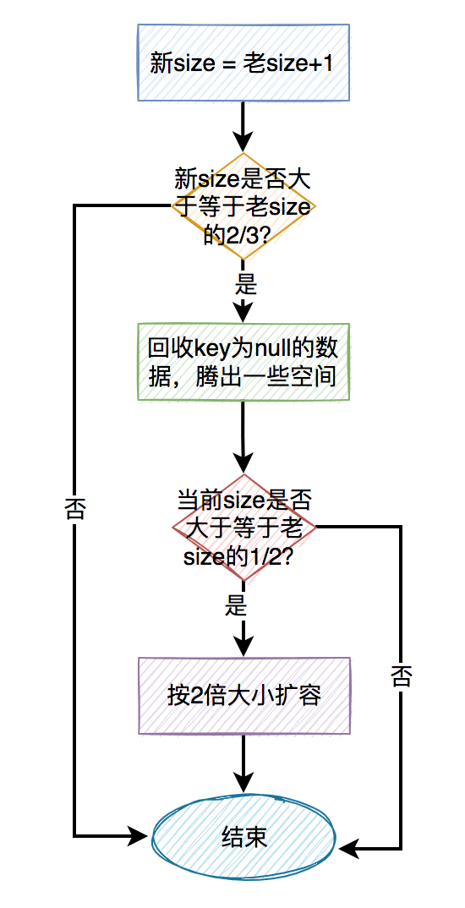

### ThreadLocal

```
线程本地存储区（Thread Local Storage，简称为TLS）每个线程都有自己的私有的本地存储区域，不同线程之间彼此不能访问对方的TLS区域。

set(T value)：将value存储到当前线程的TLS中

get()：获取当前线程的TLS区域的数据

1、每个线程都有一个ThreadLocalMap 类型的 threadLocals 属性。
2、ThreadLocalMap 类相当于一个Map，key 是 ThreadLocal 本身，value 就是我们的值。
3、当我们通过 threadLocal.set(new Integer(123))，我们就会在这个线程中的 threadLocals 属性中放入一个键值对，key 是这个threadLocal.set(new Integer(123))的threadlocal，value 就是值new Integer(123)。
4、当我们通过 threadlocal.get() 方法的时候，首先会根据这个线程得到这个线程的 threadLocals 属性，然后由于这个属性放的是键值对，我们就可以根据键 threadlocal 拿到值。 注意，这时候这个键 threadlocal 和我们 set 方法的时候的那个键 threadlocal 是一样的，所以我们能够拿到相同的值。
5、ThreadLocalMap 的get/set/remove方法跟HashMap的内部实现都基本一样，通过 "key.threadLocalHashCode & (table.length - 1)" 运算式计算得到我们想要找的索引位置，如果该索引位置的键值对不是我们要找的，则通过nextIndex方法计算下一个索引位置，直到找到目标键值对或者为空。
6、hash冲突：在HashMap中相同索引位置的元素以链表形式保存在同一个索引位置；而在ThreadLocalMap中，没有使用链表的数据结构，而是将（当前的索引位置+1）对length取模的结果作为相同索引元素的位置：源码中的nextIndex方法，可以表达成如下公式：如果i为当前索引位置，则下一个索引位置 = (i + 1 < len) ? i + 1 : 0。

内存泄漏问题：
	由于ThreadLocalMap的key是ThreadLocal对象，且是弱引用，如果一个ThreadLocal没有外部强引用来引用它，在系统GC时，会被回收，这样一来，ThreadLocalMap中就会出现key为null的Entry，就没有办法访问这些key为null的Entry的value。
	get、set、remove等方法中，都会对key为null的Entry进行清除，但是如果当前线程一直在运行，并且一直不执行get、set、remove方法，这些key为null的Entry的value就会一直存在一条强引用练：Thread Ref -> Thread -> ThreadLocalMap -> Entry -> value，导致这些key为null的Entry的value永远无法回收，造成内存泄漏。
	为了避免这种情况，我们可以在使用完ThreadLocal后，手动调用remove方法，以避免出现内存泄漏。
```

ThreadLocal从数组中找数据的过程大致是这样的：

通过key的hashCode取余计算出一个下标。
通过下标，在数组中定位具体Entry，如果key正好是我们所需要的key，说明找到了，则直接返回数据。
如果第2步没有找到我们想要的数据，则从数组的下标位置，继续往后面找。
如果第3步中找key的正好是我们所需要的key，说明找到了，则直接返回数据。
如果还是没有找到数据，再继续往后面找。如果找到最后一个位置，还是没有找到数据，则再从头，即下标为0的位置，继续从前往后找数据。
直到找到第一个Entry为空为止。

扩容的关键步骤如下：

老size + 1 = 新size
如果新size大于等于老size的2/3时，需要考虑扩容。
扩容前先尝试回收一次key为null的值，腾出一些空间。
如果回收之后发现size还是大于等于老size的1/2时，才需要真正的扩容。
每次都是按2倍的大小扩容。




## HandlerThread
HandlerThread 集成了 Thread，却和普通的 Thread 有显著的不同。普通的 Thread 主要用于在 run 方法中执行一个耗时任务，而 HandlerThread 在内部创建了消息队列，外界需要通过 Handler 的消息方式通知 HanderThread 执行一个具体的任务。

``HandlerThread.java``
```java
@Override
public void run() {
    mTid = Process.myTid();
    Looper.prepare();
    synchronized (this) {
        mLooper = Looper.myLooper();
        notifyAll();
    }
    Process.setThreadPriority(mPriority);
    onLooperPrepared();
    Looper.loop();
    mTid = -1;
}
```

HandlerThread：
	HandlerThread本质上是一个线程类，它继承了Thread；

	HandlerThread有自己的内部Looper对象，可以进行looper循环；

	通过获取HandlerThread的looper对象传递给Handler对象，可以在handleMessage方法中执行异步任务。

	创建HandlerThread后必须先调用HandlerThread.start()方法，Thread会先调用run方法，创建Looper对象。

    HandlerThread需要两个handler来进行通信，一个handler运行在HandlerThread线程中，并且在handlerMessage中执行异步操作，另一个handler则将消息传回主线程执行

    因为是两个线程的通信，因此需要两个handler

## IntentService
IntentService 可用于执行后台耗时的任务，当任务执行后会自动停止，由于其是 Service 的原因，它的优先级比单纯的线程要高，所以 IntentService 适合执行一些高优先级的后台任务。在实现上，IntentService 封装了 HandlerThread 和 Handler。


``IntentService.java``
```java
@Override
public void onCreate() {
    // TODO: It would be nice to have an option to hold a partial wakelock
    // during processing, and to have a static startService(Context, Intent)
    // method that would launch the service & hand off a wakelock.

    super.onCreate();
    HandlerThread thread = new HandlerThread("IntentService[" + mName + "]");
    thread.start();

    mServiceLooper = thread.getLooper();
    mServiceHandler = new ServiceHandler(mServiceLooper);
}
```

IntentService 第一次启动时，会在 onCreate 方法中创建一个 HandlerThread，然后使用的 Looper 来构造一个 Handler 对象 mServiceHandler，这样通过 mServiceHandler 发送的消息最终都会在 HandlerThread 中执行。每次启动 IntentService，它的 onStartCommand 方法就会调用一次，onStartCommand 中处理每个后台任务的 Intent，onStartCommand 调用了 onStart 方法：

``IntentService.java``
```java
private final class ServiceHandler extends Handler {
    public ServiceHandler(Looper looper) {
        super(looper);
    }

    @Override
    public void handleMessage(Message msg) {
        onHandleIntent((Intent)msg.obj);
        stopSelf(msg.arg1);
    }
}

···

@Override
public void onStart(@Nullable Intent intent, int startId) {
    Message msg = mServiceHandler.obtainMessage();
    msg.arg1 = startId;
    msg.obj = intent;
    mServiceHandler.sendMessage(msg);
}
```

可以看出，IntentService 仅仅是通过 mServiceHandler 发送了一个消息，这个消息会在 HandlerThread 中被处理。mServiceHandler 收到消息后，会将 Intent 对象传递给 onHandlerIntent 方法中处理，执行结束后，通过 stopSelf(int startId) 来尝试停止服务。（stopSelf() 会立即停止服务，而 stopSelf(int startId) 则会等待所有的消息都处理完毕后才终止服务）。

IntentService：
	内部是继承自Service，里面实现了HandlerThread，用HandlerThread来处理耗时操作，当处理完任务后，服务会stopSelf()，来关闭服务。内部只有一个线程，处理多任务时需要排队。默认为startService()实现的，onBind()方法里面返回null
	官方文档上对IntentService 是这样描述的：

    1、IntentService 会创建一个线程，来处理所有传给onStartCommand()的Intent请求。

    2、对于startService()请求执行onHandleIntent()中的耗时任务，会生成一个队列，每次只有一个Intent传入onHandleIntent()方法并执行。也就是同一时间只会有一个耗时任务被执行，其他的请求还要在后面排队，onHandleIntent()方法不会多线程并发执行。

    3、当所有startService()请求被执行完成后，IntentService 会自动销毁，所以不需要自己写stopSelf()或stopService()来销毁服务。

    4、提供默认的onBind()实现 ，即返回null，不适合绑定的 Service。

    5、提供默认的 onStartCommand() 实现，将intent传入等待队列中，然后到onHandleIntent()的实现。所以如果需要重写onStartCommand() 方法一定要调用父类的实现。
    
    6、每次执行完任务后，都会调用stopSelf(startId)，但是系统会等所有的任务都执行完后才真正的关闭service